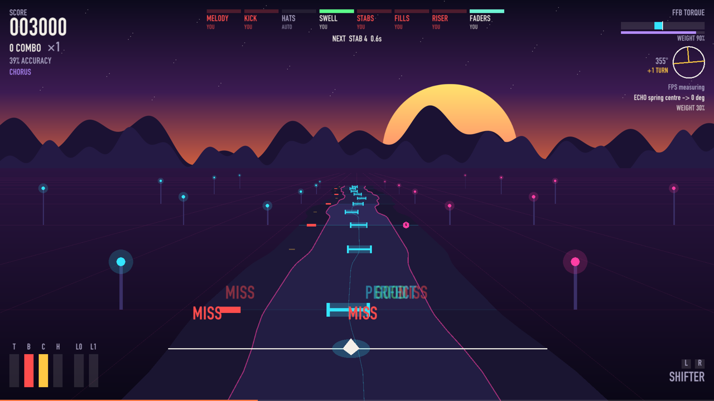

# Torque Hero

A rhythm game played on a sim-racing rig. The rig is an instrument, not a car:
the wheel plays the melody, the pedals are the drums, the shifter is a sampler,
the handbrake holds the build-up and drops the beat. Play a layer in time and
it sounds. Miss it and it drops out of the mix. The road bends with the melody
and shows you where to steer, and a direct-drive wheel base plays the beat
back into your hands.



There are no car physics, no speed and no lap times.

| Control | Layer | What you do |
|---|---|---|
| Wheel | melody | Steer onto each gate as it crosses the line. Some notes ask for one full turn (a "spin"). |
| Brake (a load cell is best) | kick | Press on the beat. A harder press is a louder kick. |
| Clutch | hat | Press on the beat. |
| Throttle | swell | Follow a target curve with the pedal. |
| H-shifter | stabs | Put the shifter in the gear the note asks for. Each gear plays a different chord. |
| Paddles | fills | Left or right paddle, as the note asks. |
| Handbrake | riser | Pull when the riser starts, hold, and let go on the drop. |
| Two throttle levers (for example a VKB STECS) | faders | Follow two target curves with the two levers. |

A layer is either **you** (you play it and the game judges it) or **auto** (the
song plays it for you). A control you do not have or do not bind makes its
layer auto, so the game works with any subset of this hardware, down to a
keyboard and mouse.

Timing windows: "perfect" is within 50 ms, "good" is within 120 ms.

In echo sections the wheel base turns the wheel by itself to show you a phrase
("listen"). Then the road goes dark and you play the phrase back ("blind").

## Status: an experimental demo

- It comes with one built-in song, and it can make charts from your own music
  (`gen`, below).
- It was built and tested on macOS without a rig, and played on one Windows PC
  with a Fanatec direct-drive base. Other wheel brands should work through
  standard DirectInput force feedback but have not been tried.
- **Force feedback on a direct-drive base can hurt a wrist.** The engine has
  many safety limits, tested in simulation, but not on every base. Play without
  force feedback first, and do the
  [force feedback checklist](docs/FFB-CHECKLIST.md) before you turn it on.
- The optional extras (triple monitors, a top monitor, a dash display, stem
  separation on an NVIDIA GPU) are all optional.

## Requirements

- Python 3.12, installed for you by [uv](https://docs.astral.sh/uv/).
- For the rig: Windows 10 or 11 and a wheel with a DirectInput driver. The rig
  steps below assume Windows.
- macOS and Linux run the game with keyboard and mouse (Linux is untested).

## Try it without a rig (any OS)

Install [uv](https://docs.astral.sh/uv/getting-started/installation/), then:

```
git clone https://github.com/icyrainz/torquehero
cd torquehero
uv run torquehero play --demo --no-ffb --kb
```

The first start installs the packages and renders the demo song, which takes a
minute. Click the game window, then press **P** or **Enter** to start. The
mouse (or A and D) steers. S is the brake, Space the clutch, W the throttle,
Shift the handbrake, 1 to 6 the shifter gears, Q and E the paddles, Escape
pauses. Keyboard play will not tell you how the wheel feels, but it shows the
song, the road and how the layers fit together.

---

## Set up your rig (Windows)

These steps take a Windows PC from a copy of this folder to a first safe song. Do
them in order. Every command goes in **PowerShell**, typed exactly as shown,
in the folder that holds this README.

To open PowerShell there: open the folder in File Explorer, click the address
bar, type `powershell` and press Enter.

### 1. Run the setup script

PowerShell blocks scripts by default. This command allows them for this one
PowerShell window only:

```powershell
Set-ExecutionPolicy -Scope Process Bypass -Force
```

Type it again in every new PowerShell window, before you run a script from
`scripts`. It changes nothing outside that window.

Then run setup:

```powershell
.\scripts\setup.ps1
```

What setup does:

1. Checks that this is Windows 11 and shows your graphics card.
2. Installs **uv** if it is missing. uv is the tool that installs Python and
   the game's packages. Setup shows the install command and asks before it
   runs it. Add `-Yes` to skip the question.
3. Installs Python 3.12 (through uv) and the game's packages (`uv sync`).
4. Puts a "Torque Hero demo" shortcut on the desktop. The shortcut starts the
   demo song **without** force feedback (`--no-ffb`), until you finish the
   force feedback checks in step 7.

Setup never changes driver settings, never starts the game and never sends
force feedback. You can run it again at any time; it only does what is
missing.

If you want to make charts from your own songs with stem separation (see
[Charts from your own songs](#charts-from-your-own-songs)), run setup with
`-Stems` instead. This downloads about 3 GB:

```powershell
.\scripts\setup.ps1 -Stems
```

If you prefer to install uv yourself, this is the official command:

```powershell
powershell -ExecutionPolicy ByPass -c "irm https://astral.sh/uv/install.ps1 | iex"
```

Close and reopen PowerShell after uv is installed, so that the `uv` command is
found.

### 2. Check what is missing

```powershell
.\scripts\check.ps1
```

It prints one line per check with PASS, WARN, FAIL or SKIP, and what to do
about each problem. It also lists your monitors and suggests the span for the
triples (step 9). Run it again after you fix something.

### 3. Set the wheel driver

Open your wheel's driver panel. On a Fanatec base that is the Fanatec App, or
the wheel property page on older drivers; other brands have their own app.

1. Set the wheel rotation to **1080** degrees. Use the fixed value, **not
   Auto**. (On a Fanatec wheel's tuning menu this is **SEN**.) The game needs one
   full turn plus the play range before the wheel reaches its lock.
2. Set the force feedback strength (**FF**) to **30 to 50%** for the first
   run. Raise it later, once the checks in step 7 pass.

The game never changes these settings. If you change the rotation later, run
`uv run torquehero bind steer` again (step 5).

### 4. See your devices

```powershell
uv run torquehero probe --live
```

This lists every game controller that Windows gives to the game, with its
axes (analog inputs), buttons and hats (4-way switches). The values update
while you move things. Press **Ctrl+C** to stop.

What to look for:

- The wheel base, with `haptic yes`. Haptic means it can do force feedback.
- The pedals, the shifter and the handbrake. If they plug into the wheel base,
  they show up as part of the base, not as separate devices. That is normal.
- A throttle with levers (such as a VKB STECS) and a button box, each as its
  own device, if you have them.

If a device is missing, see [Wheel or device not found](#wheel-or-device-not-found).

### 5. Bind your controls

`bind` asks you to move each control in turn and saves what it learns.

```powershell
uv run torquehero bind
```

For each control it first says "feet off the pedals, hands off the controls"
(or "centre the wheel and let go" for the wheel). Wait until it says "now ...",
then move the control. After each control it asks `keep? [Y/n]`. Press Enter
to keep it, or type `n` and press Enter to throw it away.

You have 8 seconds at each step. Do nothing to skip a control. To bind only
some controls, name them, for example:

```powershell
uv run torquehero bind vol_up vol_down
```

To give yourself more time at each step:

```powershell
uv run torquehero bind --timeout 15
```

What each prompt means. The examples use a Fanatec base with a GT3-style rim,
a load-cell brake, an H-shifter, a handbrake, a VKB STECS throttle and a
button box. Use whatever you have, and skip what you do not have:

| Control | Prompt | What to do |
|---|---|---|
| `steer` | turn the wheel RIGHT a little | Turn right about 20 degrees. Then it asks you to **hold the wheel at 90 degrees right** and press Enter. Hold it there (a quarter turn) with one hand and press Enter with the other. It prints the range it measured; it must say about `1080 degrees lock to lock`. |
| `brake` | press the brake pedal | Press, then press **all the way**: as hard as you would ever press in the game. A load cell needs real force. Then let go. |
| `clutch`, `throttle` | press the ... pedal | Press it to the floor, then let go. |
| `handbrake` | pull the handbrake | Pull it fully, then let go. Use the handbrake's analog mode, not button mode. |
| `lever0`, `lever1` | pull lever0 fully closed (towards you), then press Enter | The two STECS levers. This is two steps: pull the lever fully back and press Enter, then push it fully forward and press Enter. `lever1` is the second lever. The lever steps have no time limit. To skip a lever, press Enter twice without moving it: `bind` prints `skipped`. |
| `gate1` ... `gate6` | press the button you want | Put the H-shifter into gear 1, then back to neutral. Then gear 2 for `gate2`, and so on up to gear 6. |
| `paddle_l`, `paddle_r` | press the button you want | Pull the left paddle, then the right paddle. |
| `menu_up`, `menu_down`, `menu_ok`, `menu_back` | press the button you want | Menu navigation. A 4-way switch on the rim works well: up, down, push to select, and one more button for back. |
| `pause` | press the button you want | A big button on the button box. Pause stops all force feedback at once. |
| `trim_minus`, `trim_plus` | press the button you want | Nudges the audio timing by 5 ms. A rotary on the rim: one click each way. You can skip these. |
| `vol_up`, `vol_down` | press the button you want | Master volume. The button box rotary: turn one click right, then (for `vol_down`) one click left. |
| `ffb_up`, `ffb_down` | press the button you want | Force feedback gain, 0.05 per press. Two buttons on the button box, or a second rotary. |

If you see `WARNING rest ... is mid-travel`, a foot or hand was on the control
when `bind` measured its rest position. Answer `n` and bind it again.

To see what is bound now:

```powershell
uv run torquehero bind --list
```

If a pedal will not bind (a very stiff load cell), read its values with
`probe --live` and bind it by hand. For example, brake on axis 2 of device 0,
which reads -1.0 at rest and 1.0 when fully pressed:

```powershell
uv run torquehero bind brake --axis 2 --rest -1.0 --full 1.0 --device 0
```

If the measured wheel range is wrong, set it:

```powershell
uv run torquehero bind --range 1080
```

### 6. Keyboard keys

These keys always work, also when the rig is bound. The helper in step 7 uses
them.

| Key | Does |
|---|---|
| Escape or P | Pause. Stops all force feedback at once. P or Enter resumes. |
| Up, Down, Enter | Menu |
| Backspace | Back: from pause or results to the menu |
| `[` and `]` | Force feedback gain down and up |
| 9 and 0 | Volume down and up |
| `-` and `=` | Audio timing trim |

To quit the game, press **Alt+F4** in the game window, or **Ctrl+C** in the
PowerShell window.

Without a rig (`--kb`): A and D or the mouse steer, S is the brake, Space the
clutch, W the throttle, Shift the handbrake, 1 to 6 the shifter gears, Q and E
the paddles.

### 7. Force feedback first run (do this before any song)

The direct-drive base is strong enough to hurt a wrist. Before you play any
song with force feedback, **do every step of
[docs/FFB-CHECKLIST.md](docs/FFB-CHECKLIST.md), in order, sections 1 to 7.**
Stop where the checklist says stop. Do not skip a section, and do not change
the order: the sign check comes first on purpose.

You need two people: a driver at the wheel and a helper at the keyboard.

Until the checklist passes, play only with `--no-ffb` (no force feedback).
The desktop shortcut and the `.cmd` files in `scripts` use `--no-ffb` until
you change them (steps 8 and 9).

As a reminder only, the checklist runs these three test patterns, in this
order. Each plays one controlled effect at gain 0.2 (20% of the game's
maximum). The checklist says what you must feel and what to do if you feel
something else.

```powershell
uv run torquehero play --ffb-test kick --ffb-gain 0.2
```

```powershell
uv run torquehero play --ffb-test centre --ffb-gain 0.2
```

```powershell
uv run torquehero play --ffb-test echo --ffb-gain 0.2
```

**A test pattern starts stopped.** The window says `STOPPED`. Click into the
game window, then press **P** or **Enter** to start the pattern. Escape or P
stops it again. Backspace quits, but only while the pattern is stopped: while
it runs, press Escape or P first. `]` and `[` (or your `ffb_up` and `ffb_down`
buttons) change the gain by 0.05 per press. The game saves the new gain only
when the command has `--ffb-gain` (as every command here does); without it,
the test does not touch your saved gain. The `FPS` line shows the frame rate;
`SPRINGS reduced` or `SPRINGS off` after it means the frame rate is too low
for full-strength springs, and `LATCHED` means force feedback is stopped
until you press P.

For the dead-man checks (checklist sections 6 and 7), start the pattern with
P **before** the helper takes their hands off the keyboard and mouse. A
pattern that is still stopped sends no force, and the check proves nothing.

**pssuspend** (checklist section 1, step 5). Download Sysinternals PsTools
from Microsoft and copy `pssuspend.exe` into this game folder. Then, in
PowerShell in this folder, accept its licence once:

```powershell
.\pssuspend -accepteula
```

Where the checklist says `pssuspend`, type `.\pssuspend` instead, in a
PowerShell window that is open in this folder.

### 8. First song

Only after the checklist in step 7 passes. Play the built-in demo song at
gain 0.2:

```powershell
uv run torquehero play --demo --ffb-gain 0.2
```

**The song starts paused.** The game window opens without focus, and the game
pauses a song until a click or a key reaches its window. Click the game
window, then press **P** or **Enter**.

The game counts down 3 seconds, then the song starts. Force feedback runs only
while the song plays. The menu, countdown, pause and results screens send no
force.

**Windows firewall.** The first song also starts the companion pages (step 10),
a small web server. The first time, Windows asks whether Python may use the
network. While that dialog has focus, the game window does not, so the game
pauses and force feedback stops. Answer the dialog, click into the game
window and press P to go on.

- **Cancel** is fine. The pages still work on this PC.
- **Allow** (private networks only) lets a tablet or another computer open
  the pages. Allow needs an administrator account on this PC.

To make the pages local only, so the question never comes, start the game
once with this option. The game saves it in `companion.json` and uses it from
then on:

```powershell
uv run torquehero play --demo --no-ffb --companion-host 127.0.0.1
```

**Gain.** Every force feedback command in this README passes `--ffb-gain 0.2` on purpose, so
each run starts at 0.2, whatever you did before. To raise the force during a
song, press `]` (or your `ffb_up` button): each press adds 0.05, and the game
saves the new gain. To start at the saved gain instead of 0.2, leave
`--ffb-gain 0.2` out of the command. Raise it in small steps, one song at a
time.

If hits feel early or late, open **Calibrate** in the menu (play without
`--demo` to get the menu). Tap the brake on the click, and use `-` and `=`
(or your trim buttons) until the taps line up. The game saves the result.

To pick a difficulty, play without `--demo` and change **Difficulty** in the
menu, or add it to the command (after the checklist in step 7, like every
force feedback command):

```powershell
uv run torquehero play --demo --ffb-gain 0.2 --difficulty easy
```

Easy gives you the wheel, the brake and the handbrake. Normal adds the clutch,
shifter, paddles, spins and echo. Hard adds the throttle and the STECS levers.
The song plays the layers your difficulty does not give you, so you still hear
them.

**Desktop shortcut.** The "Torque Hero demo" shortcut from setup runs
`scripts\play-demo.cmd`. It starts the demo **without** force feedback. After
the checklist passes, open `scripts\play-demo.cmd` in Notepad (right-click,
Edit) and follow the note in it to switch force feedback on at gain 0.2.

### 9. Span the three monitors

The game can open one window across the three side-by-side monitors. The road
is on the centre screen.

First, in Windows **Settings > System > Display**:

1. Put the three monitors side by side, at the same height.
2. Set **Scale** to **100%** on all three. (At 125% the window comes out the
   wrong size and the game prints a `framebuffer ... differs` warning.)

The window needs the position of the **left** monitor. The easy way:
`.\scripts\check.ps1` prints the span to use, in the line `Triples span`.

You can also read it from the game. Run it once without force feedback, with
any span, then quit. As with every song, click the game window, then press P
or Enter to start it:

```powershell
uv run torquehero play --demo --no-ffb --span 5760x1080+0+0
```

At the start the game prints one line per monitor, for example:

```
monitor 0: at +0+0, 1920x1080
monitor 1: at -1920+0, 1920x1080
monitor 2: at +1920+0, 1920x1080
monitor 3: at +0-1080, 1920x1080
```

Find the three monitors that are 1080 high and share the same second number
(here `+0`). The one with the smallest first number is the left one: here
`-1920+0`. The span is `5760x1080` followed by that text:

```powershell
uv run torquehero play --demo --no-ffb --span 5760x1080-1920+0
```

If the span does not lie on the monitors, the game prints `span ... does not
lie on the monitors`.

If NVIDIA Surround joins the three monitors into one 5760x1080 display, use
`--fullscreen` instead of `--span`.

To keep your span in one place, edit
[scripts/play-triples.cmd](scripts/play-triples.cmd) in Notepad (right-click,
Edit). Change the `SPAN` line, save, and double-click the file to play. It
starts without force feedback. After the checklist in step 7 passes, follow
the note in the file to switch force feedback on at gain 0.2.

### 10. Companion pages: top monitor and dash

When the game runs, it also serves two web pages:

| Page | For | Address |
|---|---|---|
| `/top` | The monitor above the triples (1920x1080): song timeline, layer mixer, fader lanes | http://localhost:8765/top |
| `/dash` | The small dash display (800x480): combo, multiplier, layer lamps, next special note | http://localhost:8765/dash |

The game prints the addresses at the start: `companion pages: http://...`.
The pages reconnect by themselves when the game restarts, so you can leave
them open. The firewall question is explained in step 8.

To set the screens up without playing, run a moving sample. Press Ctrl+C to
stop it:

```powershell
uv run torquehero companion --replay
```

**Kiosk mode** shows a page full screen with no browser bars. Type the
commands exactly: the inner quotes keep a user folder with a space in its name
in one piece. Each window
needs its own profile folder (`--user-data-dir`), or the browser ignores the
position. Set `--window-position` to the top-left corner of the screen, as
`check.ps1` or the game's `monitor` lines show it (X,Y).

Chrome, top monitor at +0-1080:

```powershell
Start-Process chrome -ArgumentList '--kiosk', '--no-first-run', '--window-position=0,-1080', "--user-data-dir=`"$env:LOCALAPPDATA\torquehero\browser-top`"", 'http://localhost:8765/top'
```

Edge, dash display (change the position to where the dash display is):

```powershell
Start-Process msedge -ArgumentList '--kiosk', 'http://localhost:8765/dash', '--edge-kiosk-type=fullscreen', '--no-first-run', '--window-position=3840,0', "--user-data-dir=`"$env:LOCALAPPDATA\torquehero\browser-dash`""
```

Press **Alt+F4** to close a kiosk window. If it opens on the wrong screen,
close it, fix the position and run the command again.

---

## Charts from your own songs

`gen` makes a chart from any song file (MP3, WAV, FLAC and others). Put the
output in the game's `charts` folder and the song shows up in the menu:

```powershell
uv run torquehero gen "C:\Music\My Song.mp3" -o "$env:APPDATA\torquehero\charts\my-song"
```

Then play without `--demo` and pick it in the menu. Force feedback only after
the checklist in step 7 has passed; before that, use `--no-ffb` instead of
`--ffb-gain 0.2`:

```powershell
uv run torquehero play --ffb-gain 0.2
```

Or play it directly (again, after the checklist in step 7):

```powershell
uv run torquehero play "$env:APPDATA\torquehero\charts\my-song\chart.json" --ffb-gain 0.2
```

Useful options:

- `--difficulty easy`, `normal` (the default) or `hard`: how many notes the
  chart has, and which layers it gives the player (the song plays the others).
  The menu difficulty then applies on top: it also gives the song the layers
  that it does not give you, and easy removes spins and echo. The two act
  together, so the easier of the two wins. Make the chart at the difficulty
  you play it at: a hard chart played on easy still has dense wheel notes, and
  an easy chart played on hard has only the easy notes to play.
- `--force`: replace a chart you made before.
- `--bpm 128`: use this tempo. Use it when the beats in the game run twice as
  fast or half as fast as the music (the tempo was detected wrong).
- `--meter 3`: for songs in 3/4 time (a waltz). The default is 4.
- `--stems`: split the song into drums, bass, vocals and other parts first
  (with demucs, on the graphics card). The kick and hat layers then follow the
  real drums. This needs setup with `-Stems` (step 1). It takes longer: expect a
  minute or more per song.

If the tempo came out wrong, make the chart again with the right tempo:

```powershell
uv run torquehero gen "C:\Music\My Song.mp3" --bpm 128 --force -o "$env:APPDATA\torquehero\charts\my-song"
```

With stem separation:

```powershell
uv run torquehero gen "C:\Music\My Song.mp3" --stems --force -o "$env:APPDATA\torquehero\charts\my-song"
```

`check.ps1` shows whether CUDA (the graphics card support that `--stems`
uses) works.

---

## Where settings live

Every setting is a file in `%APPDATA%\torquehero`. To open the folder:

```powershell
explorer "$env:APPDATA\torquehero"
```

| File | What it holds |
|---|---|
| `bindings.json` | Your rig bindings (from `bind`) |
| `config.json` | Game settings: force feedback gain, volume, audio timing offset, wheel range |
| `app.json` | Last difficulty, whether the first-run gain is done, the charts folder |
| `audio.json` | Sound output device, `blocksize`, `latency` |
| `ffb.json` | `strength` per effect (0 to 1; it can only make an effect weaker, for example `strength.echo`), `ffb_sign` |
| `render.json` | Frame rate, vsync, anti-aliasing, font |
| `companion.json` | Address and port of the companion pages |
| `generate.json` | Stem separation model and device |
| `charts\` | Your charts; each one shows in the menu |

Edit a file in Notepad while the game is closed. To go back to the defaults for
one file, delete it.

If `config.json`, `audio.json` or `render.json` has a value the game cannot
use (a typing mistake, text where a number belongs), the game prints one
warning and uses the default for that value only. Before it next saves that
file, it keeps a copy of your version as `config.json.bad` (or `audio.json.bad`,
`render.json.bad`). After a problem in `config.json`, force feedback starts at
gain 0.2 or lower, whatever you had saved.

`ffb.json` works the same for `strength`, with one exception: if the game cannot
read `ffb_sign` (the file is broken, or `ffb_sign` is not `1` or `-1`), it does
not guess the sign. It shows `ffb.json: cannot read ffb_sign: fix the file or
delete it` and runs without force feedback until you do.

---

## Troubleshooting

### The game did not start

Start it with the least hardware: no force feedback, keyboard only.

```powershell
uv run torquehero play --no-ffb --kb
```

If that works, add the rig back one part at a time:

```powershell
uv run torquehero play --no-ffb
```

Then, only if the force feedback checklist (step 7) has passed:

```powershell
uv run torquehero play --ffb-gain 0.2
```

If it still fails, add `--no-audio` to rule out the sound device. Keep the
PowerShell window: the lines it prints say what failed. Run
`.\scripts\check.ps1` too.

### Audio crackles

The sound card gets its audio in blocks. Bigger blocks crackle less but add a
little delay. Put this in `%APPDATA%\torquehero\audio.json`:

```json
{"blocksize": 512, "latency": "high"}
```

If it still crackles, try `1024`. After a change, run **Calibrate** again
(step 8), because the delay changes.

### Wheel or device not found

- `probe` says `No joystick devices found`: check the USB cables and that the
  wheel driver is installed. Then run `uv run torquehero probe` again.
- `probe` says `bound but device not found`: a bound device is unplugged, or
  it moved. Plug it in. If it still shows, bind that control again.
- Close other programs that may hold the wheel (other games, SimHub) and try
  again.
- No force feedback: the wheel base must show `haptic yes` in `probe`, and
  `steer` must be bound to the wheel base. Force feedback always uses the
  device that `steer` is bound to.

### Steering goes the wrong way

If the road marker moves left when you turn right, bind the wheel again and
turn **right** when it asks:

```powershell
uv run torquehero bind steer
```

If the marker moves too far or not far enough, check that the wheel rotation
is 1080 in the driver (step 3), then run `uv run torquehero bind steer` again.

### Force feedback pushes the wrong way

Follow [docs/FFB-CHECKLIST.md](docs/FFB-CHECKLIST.md). In short:

- **Kick pattern, first shove goes left** (checklist section 3): quit, open
  `%APPDATA%\torquehero\ffb.json` in Notepad and set `"ffb_sign": -1`. Keep
  any other lines in the file. For example:

  ```json
  {"ffb_sign": -1}
  ```

  Run the kick pattern again. It must now shove right first.
- **Centre pattern pushes away from centre** (checklist section 4): the
  helper presses Escape at once, then quits. **Stop and report.** Do not
  change `ffb_sign` for this, and do not play.

### The window is the wrong size or on the wrong screen

Set Windows display scaling to 100% on the triples. Then read the `monitor`
lines again and fix the span (step 9).

---

## Project layout

| Path | What it is |
|---|---|
| `src/torquehero/` | The game: `app.py` (the play loop), `game.py` (judging), `chart.py` (chart format), `input.py` and `bindings.py` (the rig), `ffb.py` (force feedback), `audio.py`, `render.py` and `hud.py`, `companion/` (web pages), `generate.py` (charts from songs), `synthsong.py` (the built-in song) |
| `tests/` | The test suite: `uv run pytest -q` |
| `scripts/` | Windows setup and check scripts, and launchers |
| `docs/FFB-CHECKLIST.md` | The force feedback first-run checklist |
| `docs/design/` | Design notes, the force feedback safety rules, and the browser prototype |

Run the tests and the linter:

```
uv run pytest -q
uv run ruff check src tests
```

## License

[MIT](LICENSE). The software comes with no warranty: you use it, including the
force feedback, at your own risk.
